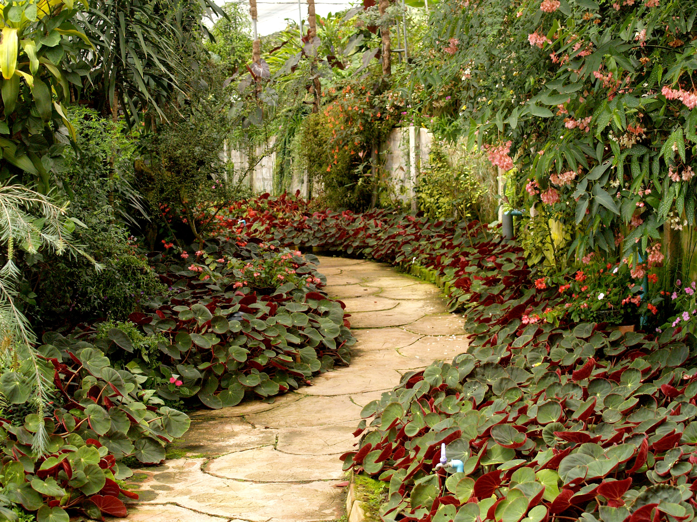
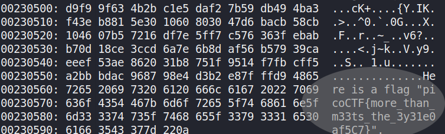

# Glory of the Garden
Points: 50

## Category
Forensics

## Question
>This garden contains more than it seems. You can also find the file in /problems/glory-of-the-garden_2_258af8e13bd7259207af0b0ee6fab645 on the shell server.


### Hint
>What is a hex editor?

## Solution 
Open terminal in the directory of the image and use:
```
$ xxd garden.jpg 
```


The flag has been found but now we must extract it.

The following command will extract the string form the hex that was dumped.
```
$ strings garden.jpg | tail -n 1 | cut -d '"' -f2
```

We can now submit the flag and complete the challenge.

### Flag
`picoCTF{more_than_m33ts_the_3y31e0af5C7}`
