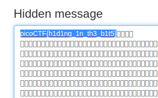

# What Lies Within
Points: 150

## Category
Forensics

## Question
>Theres something in the building. Can you retrieve the flag?

### Hint
>There is data encoded somewhere, there might be an online decoder

## Solution 
Open browse and go to 
[link to image decoder!](https://stylesuxx.github.io/steganography/)

We can now submit the flag and complete the challenge.

### Flag
`picoCTF{h1d1ng_1n_th3_b1t5}`
